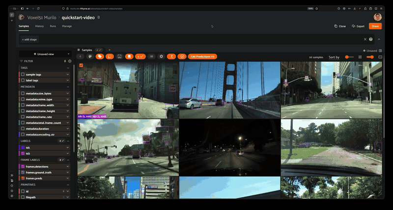

# Temporal Detection Plugin for FiftyOne

A [FiftyOne](https://github.com/voxel51/fiftyone) plugin that renders interactive temporal charts in the modal view, with **bidirectional sync**. Includes a **label timeline heatmap** (swim lane chart showing per-label detections), **line charts** for scalar (`FloatField` / `IntField`) fields, **event charts** for boolean indicators (True/False per frame), and **caption ribbons** for per-frame text (commentary, VLA instructions, scene descriptions).

Supports **native video datasets** and **dynamically grouped image datasets** (e.g., NuScenes scenes played back as video via ImaVid) across all navigation modes: pagination, carousel, and video.

- **Video/Image → Chart**: a blue vertical line tracks the current frame in real time
- **Chart → Video/Image**: click or drag anywhere on the chart to seek to that frame



## Installation

```shell
fiftyone plugins download https://github.com/mgustineli/temporal-detection-plugin
```

## Operators

All operators are unlisted (called internally by the JS panel):

| Operator | Description |
|----------|-------------|
| `get_temporal_fields` | Discovers plottable frame-level fields (`FloatField`, `IntField`, `ListField`, `BooleanField`, `StringField`) with `has_labels`/`has_tracks` flags |
| `get_frame_values` | Returns per-frame values or pre-computed segments (`mode=count` / `labels` / `tracks` / `event` / `caption`) |
| `get_detection_counts` | Legacy wrapper — delegates to `get_frame_values` with `detections.detections` |

## Panel

### Temporal Data Explorer

Opens in the modal view alongside the video player. Features:

- **Multi-chart support** — add, remove, and reorder multiple charts with per-dataset localStorage persistence
- **Label timeline heatmap** — swim lane chart with one row per label, color intensity encoding per-frame count, top-N filtering with expander
- **Line + area fill chart** of per-frame count/float/int values (floats auto-formatted to 2 decimal places)
- **Event chart** — horizontal track shaded where a `BooleanField` is True (e.g. `Turning`, `is_key_frame`)
- **Caption ribbon** — colored segment per unique caption span with a text strip showing the current caption and a hover tooltip for the full segment text
- **Blue frame indicator** (vertical line + dot + value label) tracking the current frame
- **Click/drag to seek** — click anywhere on the chart or drag to scrub through frames
- **Hover tooltip** — shows per-label counts at the hovered frame (portal-rendered, overlays other charts)
- **Status bar** showing frame number, FPS, and play/pause state

## Usage

### Native video datasets

1. Load a **video dataset** with frame-level data (e.g., `frames.detections`)
2. Open a sample in the modal view
3. Open the panel via the **+** button and select **"Temporal Data Explorer"**
4. The default chart shows a label timeline heatmap for detection fields
5. Add more charts via the dropdown — label-capable fields offer both "labels" and "count" views
6. Play the video — the blue line tracks the current frame
7. Click or drag on the chart to seek the video to any frame

### Dynamically grouped image datasets

1. Create a dynamic group view (e.g., `dataset.group_by("scene_token", order_by="timestamp")`)
2. Open a sample in the modal view (works in pagination, carousel, or video mode)
3. Open the panel — charts plot values across all images in the group
4. Navigate images (click thumbnails in carousel, arrows in pagination) — charts track position
5. Click on a chart — the displayed image changes to the corresponding frame

## How It Works

The plugin is a hybrid Python + JS implementation:

- **Python** (`__init__.py`): Operators discover temporal fields and fetch per-frame data, branching on `ctx.view._is_dynamic_groups` for grouped vs native video datasets. Label timeline mode aggregates per-label counts server-side.
- **JavaScript** (`index.umd.js`): Hand-written UMD panel (no build step) renders SVG charts with bidirectional sync. State model uses composite keys (`field:type`) for multi-chart data management.

### Sync by mode

| Mode | Image/Video → Chart | Chart → Image/Video |
|------|---------------------|---------------------|
| **Native video** | `modalLooker.subscribeToState("frameNumber")` | `modalLooker.getVideo().currentTime` + `updater()` + `pause()` |
| **ImaVid (video mode)** | `fos.imaVidLookerState("currentFrameNumber")` | `drawFrameNoAnimation()` on `ImaVidElement` |
| **Pagination** | `fos.dynamicGroupCurrentElementIndex` | `setDynamicGroupIndex(frame - 1)` |
| **Carousel** | Watch `modalSampleId` → resolve via sample ID mapping | Map frame → sample ID → `setModalSample()` via `fos.modalSelector` |

For a detailed technical walkthrough, see [PLUGIN_IMPLEMENTATION.md](PLUGIN_IMPLEMENTATION.md).

## Requirements

- FiftyOne >= 0.21.0
- Video dataset with frame-level data, or a dynamically grouped image dataset with plottable fields
